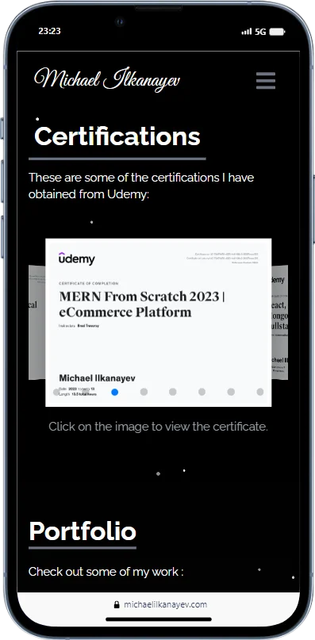

<h1 align="center">My Portfolio Website</h1>

Welcome to my portfolio website! This repository contains the source code and assets for my personal portfolio website, where I showcase my skills, projects, and experience as a software developer.

<h2 align="center">Website Overview</h2>

My portfolio website is designed to provide an overview of my journey as a software developer. It serves as a central hub for visitors to learn about my background, skills, and the projects I've worked on. The website highlights my technical expertise, project details, and ways to get in touch with me.

<h2 align="center">Live Website</h2>

Explore my portfolio website: <a href="https://michaelilkanayev.com/">https://michaelilkanayev.com/</a>

Feel free to browse through the website to get to know me better, check out my projects, and explore the technologies I work with. If you have any questions, suggestions, or would like to collaborate, don't hesitate to reach out!

<h2 align="center">Mobile Views</h2>

  
  
  
  
  

<h2 align="center">Lighthouse Report</h2>

  

